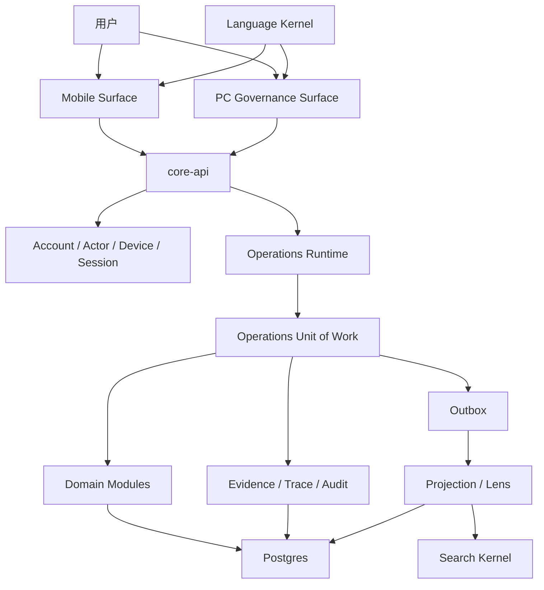

# 当前系统边界图

本图只描述当前 OAM 系统，不解释历史阶段系统。

## 1. 系统总览

## 2. 服务边界

| 服务 | 边界 |
| --- | --- |
| `core-api` | 当前唯一运行服务。承接 API、Confirm、UOW、策略、证据、投影、治理、迁移运行器 |
| `ai-personalization` | 当前无运行职责，不创建 |
| `workers` | 当前无独立后台运行职责，不创建 |

## 3. 领域模块边界

| 模块 | 输入 | 输出 | 不允许 |
| --- | --- | --- | --- |
| accommodation | 住宿资源、线索、预订、入住、退住、账本上下文 | Domain Event、WorkItem、住宿事实、交接单 | 直接做财务确认、账号治理 |
| finance-gate | 收款、押金、支出、对账、修正请求 | Ledger Entry、Finance Event、确认结果、差异和审计 | 写房间床位事实、绕过 Confirm |
| identity | 用户、角色、能力、会话、设备 | Session、Capability、Device Trust、Account Audit | 写业务事实 |
| maintenance | 服务任务对象、证据、验收 | Service Task Event、返工 WorkItem、恢复可售请求 | 在后续步骤重选任务对象 |

## 4. API 边界

业务写入只允许通过 Operations Confirm。Evidence、Reconciliation、Correction、PC Governance、Control Plane 都有自己的治理事实，但不得直接写普通业务事实。

## 5. 数据边界

`operations_cases` 是父级，`operations_work_items` 是子级。提交、证据、状态事件日志、审计、outbox、projection 都必须能追溯到 case 或 work item。

## 6. 前端边界

Mobile Surface 负责一线办理：今天、工作项、搜索、我的、Operation Panel、证据、结果、草稿。

PC Governance Surface 负责治理：财务控制、经理控制塔、治理中心、发布控制。PC 可以发治理命令和审批动作，但不能绕过 OAM 写普通业务事实。

## 7. 工具和脚本边界

脚本只能属于以下类型：

- OAM contract check
- OAM purity scan
- local OAM total gate
- API boundary check
- DB migration check
- schema validation
- coverage report
- current evidence generation
- local development helper

阶段证明、基线验收包和旧架构脚本不得保留为当前 CI 或规则来源。

## 8. 当前合并验收网

合并前必须通过当前 OAM 总门禁、合同校验、路径引用完整性、PC 单测、移动端单测、移动端覆盖率、真实浏览器 smoke、后端 Release 构建、后端测试和 Runtime Contract。PC 测试是独立验收项；合同断链、旧 artifact 引用、旧入口语义、旧运行体系字段和 Control Plane 虚假脚本引用都必须阻断合并。
